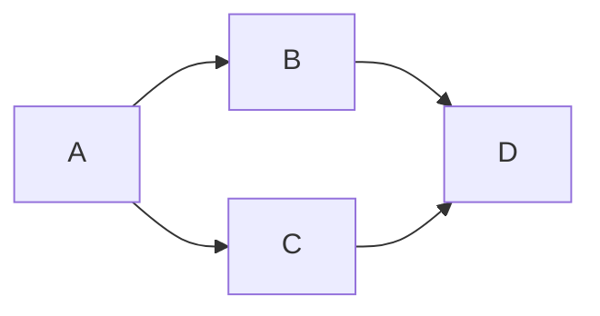

  

  <h1> Abstract </h1>
  
Our project introduces an IoMT device designed for efficient monitoring of diabetic patients' vital signs. Using near-infrared (NIR) technology, the device measures blood glucose, blood pressure, heart pulse, and oxygen levels non-invasively, ensuring patient comfort. Data is transmitted in real-time to the cloud, accessible via a mobile app for both patients and doctors. Advanced algorithms process data to provide personalized insights, enabling proactive management of diabetic conditions. This integrated solution offers convenience, remote accessibility, and improved patient outcomes in diabetic care.

  
Process Overview

   

